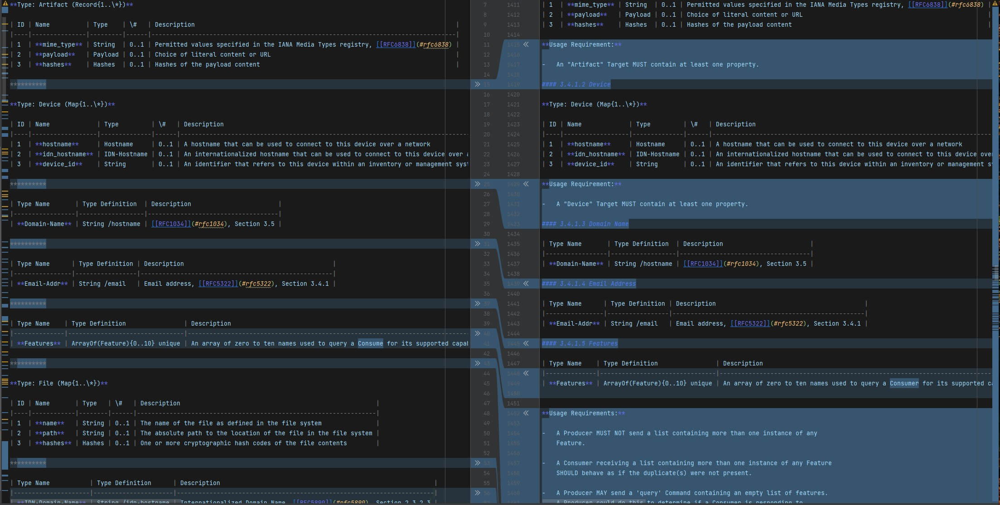
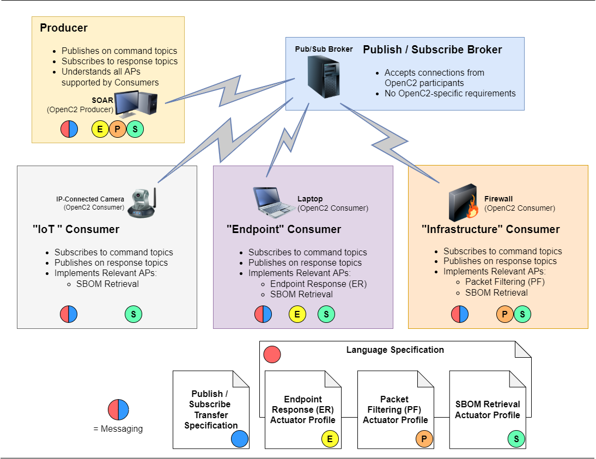

# Actuator Profile Schema Design
Developers typically use two approaches when creating a new OpenC2 actuator profile:
1) start with an existing profile and modify it to address new requirements
2) start with use case requirements and identify the data needed to satisfy them

The incremental approach can be effective when the new profile is similar
in purpose and capabilities to an existing one, but when faced with new requirements
it is more straightforward to design new data definitions directly from the use cases,
then fill in the text of a profile document around the data definitions.  A schema
can be used with both approaches to ensure that data type definitions and data
examples are both valid and consistent with each other.

### Software
This repo contains software to:
* Process [JADN](https://docs.oasis-open.org/openc2/jadn/v1.0/cs01/jadn-v1.0-cs01.html)
information models (abstract schemas) used to define 
[OpenC2](http://docs.oasis-open.org/openc2/oc2ls/v1.0/oc2ls-v1.0.html)
content as well as other types of structured data, e.g., Software Bill of Materials (SBOM) documents
* Validate data against an information model

To get started, install the JADN and Fire packages into a Python 3.8 or newer environment:
* `pip install jadn`
* `pip install fire`

The following schemas are included:
* **oc2ls-v1.1-lang** - OpenC2 language framework and Device template
* **oc2ls-v1.1-types** - OpenC2 common types
* **oc2ls-v1.1-ap-template** - Actuator profile template
* **oc2slpf-v1.1** - SLPF actuator profile
* **device-slpf-base** - Unresolved device schema for consumer that supports SLPF profile

### Translate Information Models into Multiple Formats
The `make-artifacts.py` script reads each source schema stored in the `Schemas` folder,
creates an `Out` folder, and converts each schema into multiple output formats.
Source schemas can be in JADN, JADN IDL, or HTML format.

Output formats are:
* JADN - the normative JSON format for JADN information models
* Markdown tables - the format used in current OpenC2 documentation
* JADN IDL - plain text information definition language, easier to edit than JSON or Markdown
* HTML tables - themeable tables (an example style is included in the Out folder)
* PlantUML diagram - viewable at http://www.plantuml.com
* Dot diagram - viewable at https://sketchviz.com/new
* JADN Core - JSON data with all
[extensions](https://github.com/oasis-tcs/openc2-jadn/blob/published/jadn-v1.0-cs01.md#33-jadn-extensions)
converted to core definitions

As an alternative to validating data directly using the JADN schema,
the script also creates concrete schemas specific to each supported data format:
* JSON Schema - used to validate JSON data files

To check an actuator profile, run `make-artifacts` to generate a markdown version of
the profile schema, then compare differences between the generated markdown tables and the
profile document.
In this example, most tables are identical but there is a typo ("Consumer")
to be fixed in the schema. Once `make-artifacts` reads the schema without
errors and the tables are identical, the document tables are known to be valid.

To create a new actuator profile, add custom type definitions to the actuator profile
template, then generate tables from the schema for use as the initial draft of 
the profile document.  Always generating tables from the schema rather than editing
them by hand ensures that they remain valid as the profile evolves.

### Resolve Namespaced References

A JADN schema package imports type definitions from other packages using namespaces.
The `resolve-references.py` script reads a specified package from the Schemas folder
and replaces namespaced type references with the full type definition from the referenced
package.  The result is a single self-contained package stored in the Out folder with
`-resolved` appended to the filename.

The OpenC2 language specification contains two content sections and corresponding schemas:
1. Language framework and device template
([Sections 3.2, 3.3](https://docs.oasis-open.org/openc2/oc2ls/v1.0/cs02/oc2ls-v1.0-cs02.html#32-message))
that define Message, Command, and Response:
[oc2ls-v1.1-lang.jadn](Schemas/OpenC2/oc2ls-v2.0-lang.jadn),
2. Common types
([Section 3.4](https://docs.oasis-open.org/openc2/oc2ls/v1.0/cs02/oc2ls-v1.0-cs02.html#34-type-definitions))
that are shared across actuator profiles:
[oc2ls-v1.1-types.jadn](Schemas/OpenC2/oc2ls-v2.0-types.jadn).

The Language references to Types can be resolved into a single schema file containing all
definitions in the language specification using `resolve-references.py oc2ls-v1.1-lang.jadn`.

### Create Device Schema
The OpenC2 language specification and actuator profiles all have individual schema packages.
But as described in the OpenC2 architecture, OpenC2 producers and consumers are *devices*,
each of which supports the core language plus a combination of one or more actuator profiles.
Before they can be used in a device, a device developer must:
* Create a base schema for the device, starting with the [device template](Schemas/OpenC2/oc2ls-v2.0-lang.jadn)
* Resolve profile schemas into the [base schema](Schemas/OpenC2/device-pac-slpf-base.jadn)
to produce the [device schema](Schemas/device-pac-slpf.jadn)

The process to create a device schema is:
1. Create a device template starting with a copy of the language schema oc2ls-v1.1-lang.jadn
   1. edit the package, version, title, etc to reflect the name of the device
   2. edit namespaces to include only actuator profiles supported by the device
   3. delete all fields from Action, Target, Args, Actuator, and Results that are not used by any supported profile
2. Run `resolve-references.py device-slpf-v1.1.jadn` to generate the device schema
"device-slpf-v1.1-resolved.jadn" containing the device-specific tailored language framework,
the Targets, Args, Actuators, and Results defined in all supported profiles, and the
common types referenced by the profiles.

### Validate Test Data Against Device Schema
Once the schema for a device supporting one or more actuator profiles has been created,
it can be used to validate example/test data for good and bad OpenC2 commands and responses.